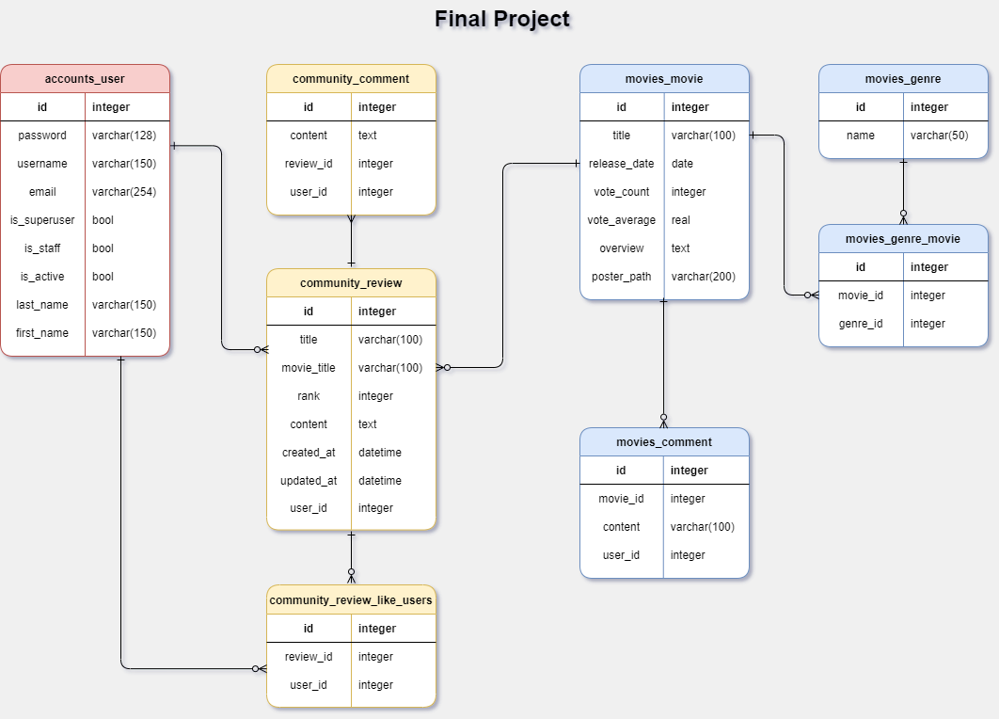

# FINAL PROJECT (추천 시스템 기반 영화 사이트)

⮞*손한기*, *장하석*

⭕싸피 6기 1학기 관통 프로젝트입니다.

- 자체 데이터 베이스를 구축해서 20년 분량의 영화 데이터를 확인할 수 있도록 하였습니다.
- 자연어 처리를 바탕으로 데이터를 가공하여 학습모델을 만든 뒤, 영화 추천시스템을 구축하였습니다.
- 유저간의 커뮤니케이션을 위한 게시판을 만들었습니다.

## 목차

- [FINAL PROJECT (추천 시스템 기반 영화 사이트)](#final-project-------------------)
- [Maintainers](#maintainers)
- [미리보기](#미리보기)
- [설치](#설치)
    + [Issues](#issues)
- [ERD](#erd)
- [개발 일지](#개발-일지)
  * [목표](#목표)
  * [구현](#구현)
- [기능 소개](#기능-소개)
  * [HOME](#home)
  * [Movie](#movie)
  * [Reviews](#reviews)
  * [Recommend](#recommend)
- [마치며...](#마치며...)

# Maintainers


---

### 손한기

- 시스템에 필요한 DB 를 웹 크롤링을 이용하여 수집 (영화데이터 6600개, 리뷰데이터 3만개)

- Recommend System 제작
  - 수집한 데이터를 전처리 (Tokenization, 불용어 처리)
  - TF-IDF 모델을 이용하여 문서 내 단어의 빈도 확인 및 유사도 체크
  - Word2Vec 모델을 활용하여 Cos 유사도를 확인하는 시스템 구축
  - Konlpy 관련 이슈 처리
  - Recommend System 에 필요한 server , client 구축
  - 패키지 충돌 이슈 및 JAVA DIRS 관련 이슈 처리
- Main Page(Home) 제작
- 프론트 페이지 아웃라인 가이드 제작 및 CSS 적용

---

### 장하석

- ERD 설계
  - DB modeling
  - Model 및 Serializers생성
- DRF Server, Client 구축
  - Movie System
  - Review System
  - Comment System 
  - Login, Signup System
- 사용자 편의 개선을 위해 SPA 를 이용한 구성(Router)
- 페이지 내부 액션, css design 요소 추가

---


# 미리보기


​																					**메인 페이지**


​																					**추천 시스템**

# 설치

**⭐설치 전 유의 사항⭐**

- 본 프로젝트는 VScode, node.js, vue, Django, SQLite, JAVA 를 사용하고 있습니다.
- 현재 Konlpy에 issues 가 있습니다. pip install 시 수동으로 파일을 붙여넣어 주세요.

**⭐설치 순서⭐**

- git clone https://lab.ssafy.com/haseok1020/pjt-final.git
- 가상환경 설정
- vs code 를 통해 pip install -r requirements.txt 진행
- assets 에 jvm을 덮어 쓰기 해 주세요 (issues 참고)
- server dir 진입 후 migrate 
- assets 폴더에 있는 dbinsert.sql 을 이용하여 csv 파일 3개를 import 해주세요
- 이후 python manage.py runserver
- client dir 진입 후 npm istall package-lock.json 진행
- 이후 npm run serve

### Issues

---

**⭐ assets의 jvm.py 파일을 pjt-final\server\venv\Lib\site-packages\konlpy 위치에 덮어쓰기 해주세요 ⭐**

****

```
⭐for mac

1. silicon mac은 pip install 문제로 recommend는 사용 불가
   -> pip install -r requirements_mac.txt
2. 일반 맥은 설치가 안되면 pip 대신 conda를 사용해 보세요
   ⭐
```

---

**⭐Error: EBUSY: resource busy or locked 에러 발생시⭐**

- npm install next-redux-wrapper 진행해 주세요

----

**⭐Java Dir 관련 에러 발생시**⭐

- JAVA가 설치된 위치를 찾게 해주기 위해 **환경변수 설정**해야 합니다.
- JAVA 가 설치 되지 않았다면 설치를 진행해 주세요
- JAVA 가 설치된 local folder 로 이동해 주세요
- 제어판 > 시스템 및 보안  > 시스템   > 고급 시스템 설정
- 고급 > 환경변수 에 JAVA HOME 을 등록해 주세요.
- 자세한 등록 방법은 다음을 참고해 주세요 https://macchiato.tistory.com/9

---


# ERD



# 개발 일지 (https://www.notion.so/stoneage)

## 목표

- 자체적인 영화 정보를 가지고 있는 영화 사이트를 구현
- 자연어 처리 기반의 추천 알고리즘 구현
- 로그인, 회원가입을 통한 유저 간 소통기능 구현
- DRF 를 이용한 프로젝트 진행 

## 구현

- 11월 17일
  - ERD 작성, 
  - 데이터 베이스 크롤링 시작
  -  DRF,Vue 기초 골격 작성
- 11월 18일
  - Recommend system 알고리즘 제작 및 데이터 수집
  - Client - Server 연결 작업 
  - Movie,Community 의 model, serializer 작성
- 11월 19일
  - Vue router, store 추가
  - Vue- MovieList, MovieDetail 추가
  - Konlpy 관련 issues 해결
- 11월 20일
  - 중간 디버깅 및 css 적용
  - 추천 알고리즘 용 데이터 전처리
  - login page 작성
- 11월 22일
  - 추천 시스템용 모델 제작 및 적용
  - Vue - Review 생성 및 Server 연결
  - Genres 데이터 크롤링 및 연결
  - Poster_Path 관련 issues 해결
- 11월 23일
  - Home Page 제작
  - 자연어 처리 과정중 발생한 memory issues 해결
  - login page 폐기 및 login,signup modal 생성
  - 세부요소 디버깅
- 11월 24일
  - 영화 목록을 불러올 때 과도한 데이터가 오는 것을 개선
  - 리뷰작성 속도 개선
  - 리뷰목록 선택하여 볼 수 있도록 개선
- 11월 25일
  - 최종 제출 이전 디버깅 및 CSS 
  - undefined issue 해결


# 기능 소개


## HOME


- Carousel 을 이용한 주요 이슈 소개합니다.
- Slider 을 이용하여 장르별, 주제별 추천 영화를 감상할 수 있습니다. 
  - 각각의 Slider 은 영화 pk 값을 바꿔주는 것으로 쉽게 유지보수가 가능합니다.
- 포스터를 클릭하면 해당 영화 또는 기능으로 이동할 수 있습니다.


## Movie


- 2021년 부터 2000년 까지 약 6600 개의 자체 DB 를 통해 영화 데이터를 제공합니다.
- Movies 에서는 여러 영화의 정보를 hobar로 제공합니다.
- 디테일 페이지에서는 각 영화의 정확한 정보 및 그 영화와 관련된 추천 영화를 제공합니다.
- 코맨트 기능을 통해 유저간 소통을 할 수 있습니다.
- 해당 영화와 관련 된 리뷰를 볼 수 있습니다.


## Reviews


- 사용자들이 작성한 리뷰를 볼 수 있습니다.

- 새로운 리뷰를 생성하고, 새로운 코맨트를 입력할 수 있습니다.

- 각 리뷰에 좋아요를 할 수 있습니다.

- 리뷰의 수정, 삭제가 가능합니다.

- 특정 영화의 리뷰만을 확인할 수 있습니다.

  

## Recommend


- 키워드를 입력하여 유사한 사용자 리뷰를 가진 영화 추천 기능

  - 3가지 키워드를 통해 가장 유사한 영화 20개의 목록을 제공 합니다.

- 타이틀을 입력하여 입력한 영화와 Cos 유사도가 높은 영화를 추천하는 기능

  - 입력받은 영화제목을 통해 자체 DB 에서 엄선한 추천 영화 20개를 제공합니다.

  

---

# 마치며...

#### 손한기 

```
관통 프로젝트를 진행하면서 싸피 1학기의 모든 지식을 활용하는 경험을 하였습니다. 
학기 초에 배웠던 크롤링과 파이썬을 이용한 알고리즘 구현, 그리고 웹 제작을 모두 쓰면서 
한 학기동안의 수업이 새록새록 생각났습니다. 
과연 시험을 위해서 치열하게 공부하지 않았다면 이렇게 프로젝트를 완료할 수 있었을까? 
하는 생각이 들면서 개발자로써 알게모르게 성장했구나 하는 생각이 들었습니다.
개인적으로 공부하던 자연어 처리를 이용하여 추천 시스템을 구현하면서, 
이론만 배울때는 알지 못했던 즐거움을 알 수 있었습니다.
개발은 혼자서 하는 것이 아니라 동료와 함께 한다는 것, 그리고
좋은 동료와 함께 프로젝트를 하는 것이 정말 즐겁다는 것을 알게 되어 기쁜 시간이었습니다.
```


#### 장하석 

```
it개발자를 꿈꾸는 비전공자로 싸피에 들어와
 정신없이 배우고  익히다 보니 벌써 1학기가 끝나고 관통프로젝트를 제작하게되었습니다.
프로젝트를 처음부터 직접 구상하고 제작하다보니 
어렵고 힘들었지만 마음이 맞는 동료를 만나 
서로의지하고 협력하면서 완성할 수 있었습니다.
배포도 못하고 부족한 부분이 많은 프로젝트지만
소중한 추억과 경험을 얻어 감사하고 행복했습니다.
```


 

